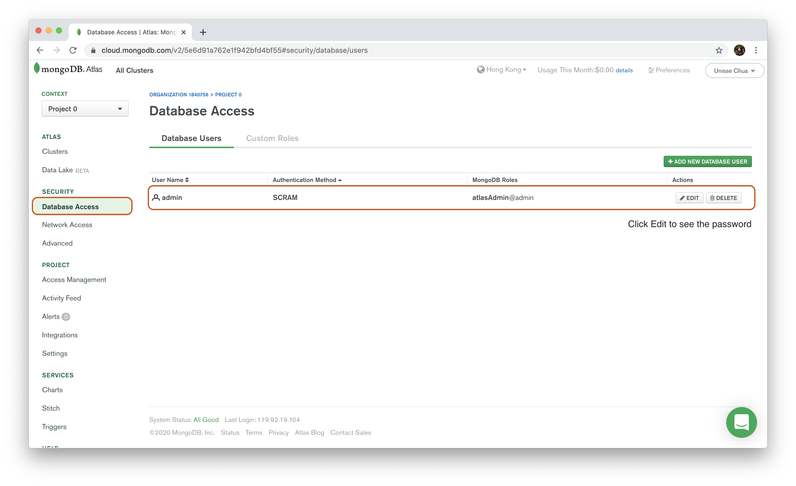

# Set Up MongoDB Atlas

To get started, make sure you have a MongoDB Atlas account. If you don't have one yet, [register here](https://www.mongodb.com/cloud/atlas/register).


Once logged in, you should be redirected to the Clusters dashboard.


Click the `Build a Cluster` button and select the **Shared Clusters** which is **FREE**.


Select your preferred provider and region and rename your cluster (expand the Cluster Name toggle to edit). I'm using AWS and a server in Singapore since it's closer to the Philippines.


Click `Create Cluster`. It will prompt to suggest that you upgrade to a dedicated cluster but simply click on the link at the very bottom that says "Continue without upgrading".

Wait for your cluster to be setup. It might about 1-3 minutes to provision. Once it's done, refresh the page and you should see the created cluster in your Dashboard.


To connect to the database, click on the `Connect` button under the cluster name. A pop up will display and select the option: "Connect your application".


It will then ask you what Driver and Version, by default, Node.js is already selected. Click the copy button as shown to copy the URI to the clipboard.


Paste the connection URL in [`models/connection.js`](../models/connection.js).
```JavaScript
const databaseURL = 'mongodb+srv://admin:<password>@ccapdev-test-fmitn.mongodb.net/test?retryWrites=true&w=majority';
```

The default URL is set to a `test` database. Replace it with `logindb` or the name of your database. Make sure to replace the `<password>` with the actual password of your user.

To check the users, go to the **Database Access** on the side nav.


If there are no users, you can simply add a user by clicking the "Add New Database User" button. Fill in the form and provide the User Privileges.


Before your application can access the database, the IP addresses allowed to connect to the remote database need to be configured. Go to **Network Access** on the side nav.


If you've already whitelisted your IP address, you might see a record there. We can leave it there for now.

Click the "Add IP Address" button. It will open a pop up. Click the "Allow Access From Anywhere" button and it should fill up the Whitelist Entry text box with `0.0.0.0/0`. This allows all IP addresses to connect to the database. In an ideal production set up, this should not be the case and we should only allow the server's IP to access the database.


Now, test if the application runs with the new database URL.  Navigate to [http://localhost:9090/](http://localhost:9090/) and it should show the login page.

Go back to the **Clusters** tab and click the "Collections" button from the dashboard.


There should already be a `logindb` database with a `sessions` collection.
.

Try registering for a user in the app and logging in. It should also create the `users` collection under `logindb`. After registration and login, you should be redirected to the home page.


Now, our app is connected to a cloud-based database!

#### Next: [02-DOTENV.md](02-DOTENV.md)
