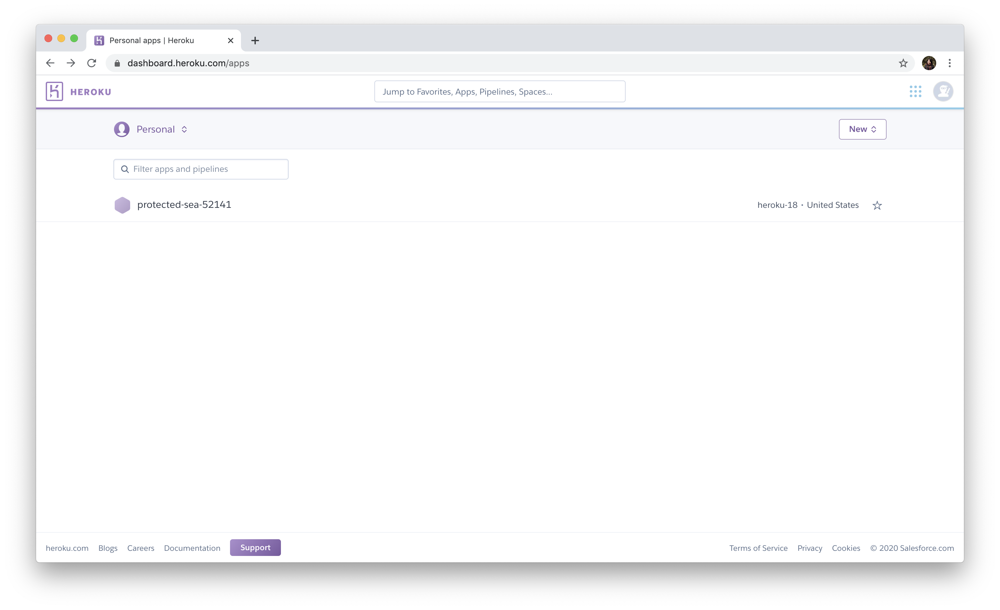
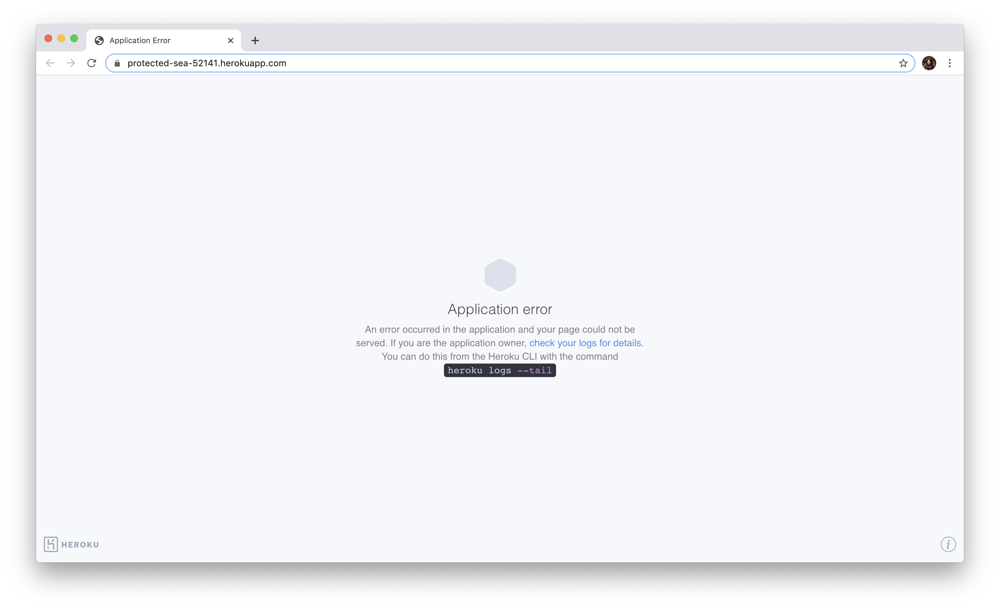
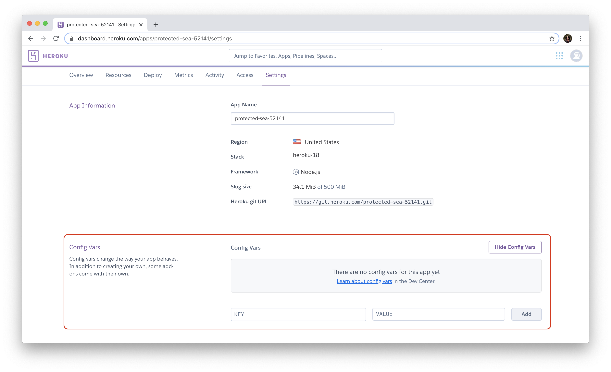
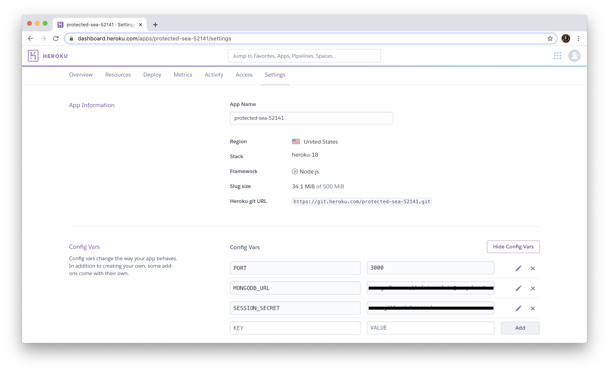

# Deploying the App
Now that everything's configured. Let's deploy the application. Make sure you create an account on [Heroku](https://www.heroku.com/) first.

Install the [Heroku CLI](https://devcenter.heroku.com/articles/heroku-cli#download-and-install). Once installation is complete, you can now use the `heroku` command in the terminal.

Use the `heroku login` command to login to your Heroku account. It will open up the browser for login.
```shell
heroku login
```

Before we continue, let's check for the versions of the dependencies for Heroku. Run the commands and keep track of the version numbers.
```shell
$ node --version
v12.4.0
```

```shell
$ npm --version
6.14.4
```

```shell
$ git --version
git version 2.20.1
```

## Additional Configurations
Before we deploy the app, let's configure how the app should be run by Heroku first.

Heroku uses a file named `Procfile` to know specifically what command to execute to be able to run the application. Create the file `Procfile` with the following content.
```
web: node app.js
```

In addition to this, Heroku checks the `package.json` to know what engine the app is supposed to run so make sure the `package.json` has all the dependencies including the `engine` version.
```json
{
  ...
  "engines": {
    "node": "12.x"
  },
  "dependencies": {
    "bcrypt": "^4.0.1",
    "body-parser": "^1.19.0",
    "connect-flash": "^0.1.1",
    "connect-mongo": "^3.2.0",
    "cookie-parser": "^1.4.5",
    "express": "^4.17.1",
    "express-handlebars": "^4.0.0",
    "express-session": "^1.17.0",
    "express-validator": "^6.4.0",
    "handlebars": "^4.7.3",
    "moment": "^2.24.0",
    "mongoose": "^5.9.6"
  }
  ...
}
```

## Deploy Time!

Since our application is already connected to a `git` repository, we can now directly create the Heroku app.
```shell
$ heroku create
Creating app... done, ⬢ protected-sea-52141
https://protected-sea-52141.herokuapp.com/ | https://git.heroku.com/protected-sea-52141.git
```
By default, you can simply run `heroku create` and Heroku will give a random name for your application (`protected-sea-52141`). But you can also specify the name of your application as an additional argument.

Go to your [Heroku Dashboard](https://dashboard.heroku.com/apps) to see the created app.


When you create an app, a git remote (called `heroku`) is also created and associated with your local git repository. Before pushing any changes to the `heroku` remote branch, make sure all changes are commited first.
```shell
git add .
git commit -m 'Update code for deployment'
```

To deploy the application, simply push the code to the `heroku` branch:
```shell
git push heroku master
```

To know that it was completely deployed, you should see at the end of the build:
```
...
remote: Verifying deploy... done.
To https://git.heroku.com/protected-sea-52141.git
 * [new branch]      master -> master
```

According to the [Heroku Guide](https://devcenter.heroku.com/articles/getting-started-with-nodejs?singlepage=true#deploy-the-app), to ensure that at least one instance is running, execute this command:
```shell
heroku ps:scale web=1
```

To access the app and get the URL of your application, run:
```shell
heroku open
```

Don't panic. The expected output is an application error (for now).


This is mainly beacuse we haven't set up our environemnt variables for Heroku! Our code is expecting environment variables so we need to set this up first. There are [two ways](https://devcenter.heroku.com/articles/config-vars#managing-config-vars) to do this:
1. Use the Heroku CLI
2. Go to the app's **`Settings`** tab from the [Heroku Dashboard](https://dashboard.heroku.com/apps).

Let's do the second option. Go to the **`Settings`** tab of your application and click the "Reveal Config Vars" button.


Use the `.env` file created previously to create the config vars. No need for the quotes, just paste the values and make sure to click **Add**.
.

Once that's set up, try refreshing the page or run:
```shell
heroku open
```

You can also test if the code works locally, by running:
```shell
heroku local web
```

This will simply get the values from the local `.env` file and whatever's in the current repository. To ensure that changes get deployed, do not forget to **COMMIT** the changes to the code.

That's it! You now have a fully deployed application on Heroku!
